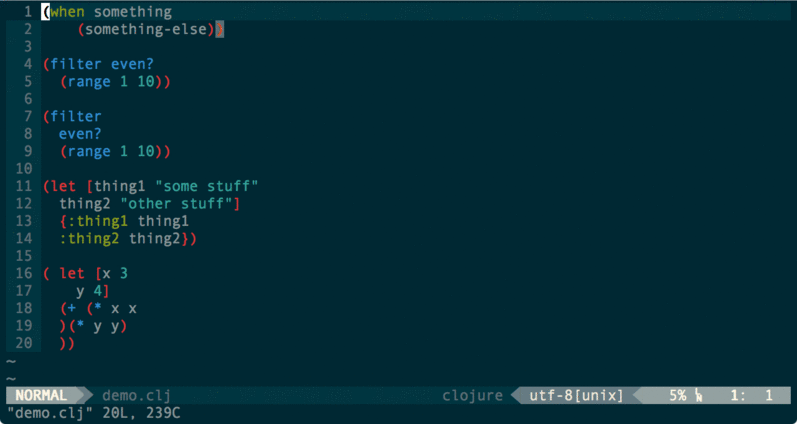

# vim-cljfmt

vim-cljfmt is a vim plugin for [cljfmt](https://github.com/weavejester/cljfmt), the code formatting tool for Clojure(Script). Rather than invoking the plugin by shelling out to Leiningen, it uses a [vim-fireplace](https://github.com/tpope/vim-fireplace/) REPL connection to only format the current file. This has the advantage of sidestepping Leiningen's startup time and keeping Vim from hanging, though the first time you use it with a given REPL server there will be a slight delay as it loads the cljfmt namespace.

Demo below:



## Configuration and Usage

vim-cljfmt allows you to format the file in the current buffer with the following:

```vim
:Cljfmt
```

Of course, manually formatting files is for people who aren't lazy. So, by default, vim-cljfmt automatically does the formatting when you save. If you want to turn this off, add the following line to your `.vimrc`:

```vim
let g:clj_fmt_autosave = 0
```

To format the code in current visual selection use the following command:

```vim
:'<,'>CljfmtRange
```

##### Re-starting the REPL while editing

If you expect the have to re-start the REPL while working, you have two options. You can manually re-load vim-cljfmt from within Vim with the following:

```vim
:CljfmtRequire
```

Alternatively, you can add the following line to your `~/.lein/profiles.clj`:

```clojure
:repl-options {:init (require 'cljfmt.core)}
```

The latter will slow down your REPL startup time, but will mean you won't have to do any extra typing if you restart your REPL. Personally, I prefer this approach.

## Installation

### Requirements

You'll want to have [cljfmt](https://github.com/weavejester/cljfmt) and [vim-fireplace](https://github.com/tpope/vim-fireplace/) installed, and you'll need to make sure Cljfmt is somewhere on your project's classpath. I'd recommend adding the following to your `~/.lein/profiles.clj`:

```clojure
:dependencies [[cljfmt "0.5.1"]]
```

You'll also need to have a REPL connection open through fireplace.

After that, the rest should take care of itself.

### Installing with Pathogen

Assuming you already have [Pathogen](https://github.com/tpope/vim-pathogen) installed, you should be good to go with the following:

```
cd ~/.vim/bundle && \
git clone https://github.com/venantius/vim-cljfmt.git
```

### Installing with Vundle

To install vim-cljfmt with [Vundle](https://github.com/gmarik/Vundle.vim), add the following line to your `.vimrc`:
```
Bundle 'venantius/vim-cljfmt'
```

## Other Vim + Clojure Plugins

If you like this, you should check out [vim-eastwood](https://github.com/venantius/vim-eastwood)!

## License

Copyright (c) 2015 W. David Jarvis.

Licensed under the Eclipse Public License, the same as Clojure.
